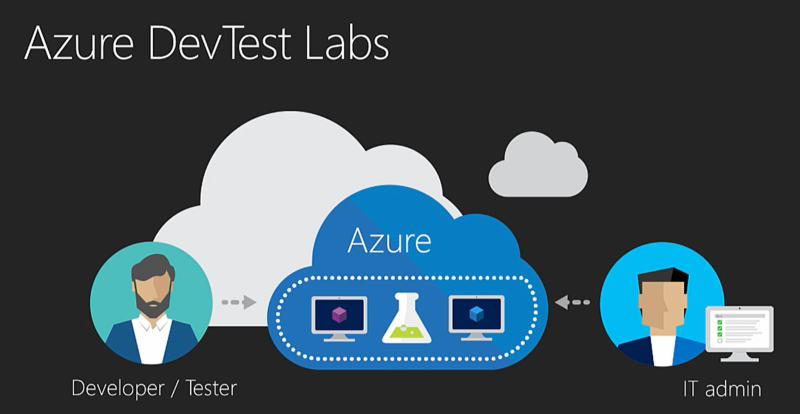
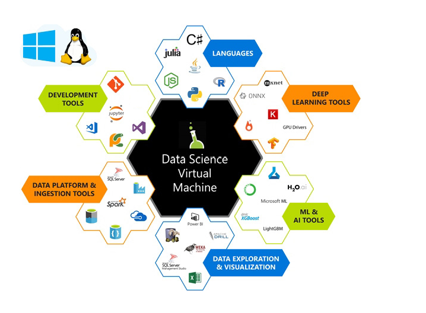
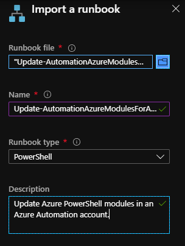
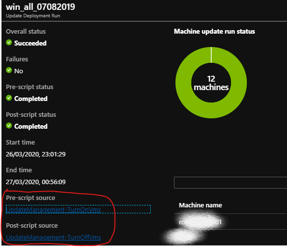

We regularly help our customers to use Azure's [**DevTest Labs**](https://docs.microsoft.com/en-us/azure/lab-services/)  in combination with [**Data Science Virtual Machines**](https://azure.microsoft.com/en-us/services/virtual-machines/data-science-virtual-machines/) to safely and securely spin up the required resources for rapid-fire projects without slowing down the pace of innovation and time-to-market for new ideas.

One aspect of providing a secure environment is ensure that machines are regularly patched and operating systems and software kept up to date to limit the risk of vulnerabity to expliots and fix bugs.

At the time of writing, I'm part of a small team supporting a variety of teams in various parts of the business who need access to such environments at short notice and we don't have the time to be patching virtual machines one-by-one on a routine basis. As a result we need to use as much automation as we can to do this for us.

This article is about how we used Azure's Update Management solution to keep Virtual Mchines in DevTest Labs up to date with very little manual intervention from the administrators (*that's us!*).

## About DevTest Labs

**DevTest Labs (DTL)** enable project team members to self-manage virtual machines (VMs) without waiting for approvals, or for an administrator to create and configure it for them.

This allows us to offer pre-configured base machines (both Windows and Linux) which have all the necessary tools and software built-in which users can then spin up in just a few minutes.

### Secure Environment

VMs are made avaiable in a DTL and depending on requirements we typically be protect them as follows:

- Placing the VMs into a subnet within a private Virtual Network (VNET) so that a perimeter firewall device can be used to filter and log internet and intra-network access.

- Applying a User Defined Route (UDR) to ensure that all traffic from the subnet traverses the firewall.

- The DTL works on our behalf to ensure that each of the virtual machines and its associated resources are deployed into a separate resource group RBAC is used to limit who can change settings or gain access to the virtual machine. The user who has claimed the machine has just enough rights to use it but not modify anything else.

- Using [DevTest Lab Artifacts](https://docs.microsoft.com/en-us/azure/lab-services/add-artifact-vm) to add additional components and configure the operating system and machine policy.

- Using Azure's **Update Management** solution (see below) to keep operating systems patched. *This topic is the main focus of this article.*

## Tools for Data Science

Our customers have more and more data and they are asking more a more comlex questions of that data. Developers and Data Scientists are engaged to find the answers and they need to quickly spin up an environment with all the right tools.

[Data Science Virtual Machines](https://azure.microsoft.com/en-us/services/virtual-machines/data-science-virtual-machines/) (DSVM) are a customized VM image which we typically make available for end-user selection in our DTL environments. These are VMs built specifically for doing data science. They come pre-installed and pre-configured with many popular data science tools which helps to jump-start data engineering and advanced analytics.

The combination of DSVMs and a DevTest Lab Environment is a powerful enabler for people to get started on the job quickly without worrying about precious data assets falling into the wrong hands.

## Azure Automation - Update Management

We use the [Update Management](https://docs.microsoft.com/en-us/azure/automation/automation-update-management) solution in [Azure Automation](https://docs.microsoft.com/en-us/azure/automation/) to manage operating system updates for virtual machines in our DevTest Labs in Azure.

Update Management scans and displays the status of available updates and it manages the process of installing required updates on each machine on a configurable schedule.

Here's what we needed:

- Update Management can only patch a machine whilst it's running

- Machines are shut down automatically by the DevTest Labs environment out of working hours to save costs and therefore machines are only running during the daytime.

- We want to limit how much we interrupt a user while they're using their VM so any system maintenance needs to happen out-of-hours.

As such we needed to find a way to ensure that virtual machines were running when the patching process starts but are shut down again afterwards to limit costs.

### Using pre and post-scripts to prepare machines for patching

Pre-scripts and post-scripts let you run PowerShell runbooks in your Azure Automation account before (pre-task) and after (post-task) a scheduled update management deployment.

The documentation ['Manage pre and post-scripts'](https://docs.microsoft.com/en-us/azure/automation/pre-post-scripts) provided us with most of what we needed to know. At time of writing the document does a good job of explaining the general concept of pre and post-scripts using script gallery samples such as `UpdateManagement-TurnOnVMS` and `UpdateManagement-TurnOffVMs` as examples of what you can do with these kinds of runbooks. In this article I'll fill in a few gaps in the end-to-end steps we needed to take to get these start/stop scripts working for us as a routine patching solution.

- [UpdateManagement-TurnOnVms](https://www.powershellgallery.com/packages/UpdateManagement-TurnOnVms) - ensures all Azure VMs in the Update Deployment are running so they recieve updates. It stores the names of machines that were started in an Automation variable so only those machines are turned back off (by the accompanying *UpdateManagement-TurnOffVms* script) when the deployment is finished.

- [UpdateManagement-TurnOffVms](https://www.powershellgallery.com/packages/UpdateManagement-TurnOffVms) - ensures that all Azure VMs in the Update Deployment are turned off after they recieve updates by reads the names of the machines from the Automation variable.

Source code for the above modules [can be found from **zjalexander** in GitHub](https://github.com/zjalexander/UpdateManagement).

The ReadMe document in GitHub explains that the scripts have the following requirements, which I'll explain in a bit more detail here.

- Follow these links to create an [**Automation Account**](https://docs.microsoft.com/en-us/azure/automation/automation-quickstart-create-account) and a linked [**Log Analytics Workspace**](https://docs.microsoft.com/en-us/azure/azure-monitor/platform/data-platform-logs) with the [**Update Management**](https://docs.microsoft.com/en-us/azure/automation/automation-update-management) solution enabled.

- A **RunAs account** for interacting with the Azure services used by these scripts.
    - Follow this document to [Create a Run As account](https://docs.microsoft.com/en-gb/azure/automation/manage-runas-account#creating-a-run-as-account-in-azure-portal) either in Azure portal or or with PowerShell. Be aware that you need sufficient privileges (at least Application administrator in Azure Active Directory and an Owner in a subscription) to complete this task.

- The **ThreadJob** module imported into your Automation Account.
    - The UpdateManagement modules both depend on the [ThreadJob module](https://www.powershellgallery.com/packages/ThreadJob). This module extends the existing PowerShell BackgroundJob to include a new thread-based job to provide faster operation with less overhead. To install it
        - go to the URL in a browser <https://www.powershellgallery.com/packages/ThreadJob>
        - click on the 'Azure Automation' tab
        - click on the button 'Deploy to Azure Automation'
        - pick the Subscription name, Resource Group and Location and select the Automation Account you want to install the module into.

- The **latest versions of the AzureRM** modules.
    - In order to [Update Azure PowerShell modules in Azure Automation](https://docs.microsoft.com/en-gb/azure/automation/automation-update-azure-modules) need to download the [Update Azure modules runbook](https://github.com/Microsoft/AzureAutomation-Account-Modules-Update) from GitHub and import and publish it into the list of Runbooks your Automation Account.

        

!!!tip "Top Tip"
    Rather than download the runbook powershell script from GitHub, you can directly paste the 'raw' file URL from GitHub into the 'Runbook file' textbox i.e. '<https://raw.githubusercontent.com/microsoft/AzureAutomation-Account-Modules-Update/master/Update-AutomationAzureModulesForAccount.ps1>'

Now you can use the **Runbook Gallery** to import the start-stop scripts as follows:

- In the Azure portal, open your Automation account
- Under Process Automation, click on **Runbooks Gallery**
- Select *'Source: Script Center'*
- Enter 'UpdateManagement' into the search box
- select each module and click **'Import'**:
    - *Update Management - Turn On VMs*
    - *Update Management - Turn Off VMs*

!!!warning "Important"
    After you import runbooks you need to publish them before they can be used. To do this, find the runbook in **Runbooks** pane and click **Edit** and **Publish**.

Visit the Docs page for details on [how to use these pre and post-scripts in your update deployment](https://docs.microsoft.com/en-us/azure/automation/pre-post-scripts#using-a-pre-script-or-post-script). 

Here's what one of my update deployment runs looks like with the script status showing completed:

