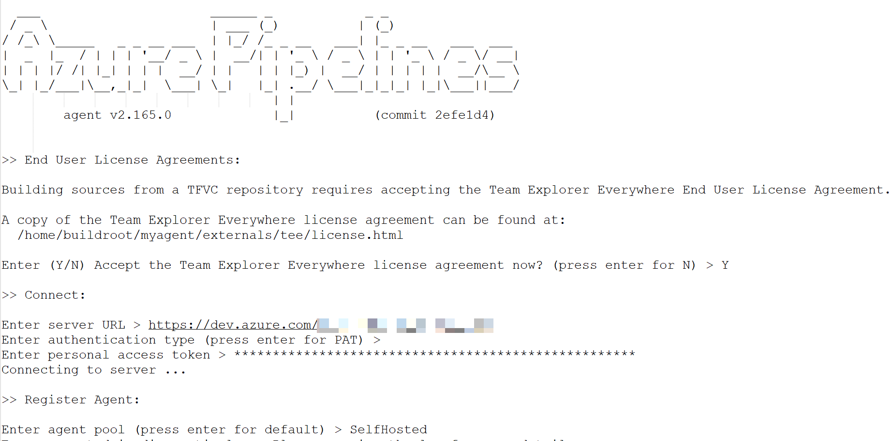

## Self-Hosted Agents

When my colleagues needed a build agent that could communicate with Azure Resources (such as Storage Accounts) inside of a private Virtual Network then the only way to do this without whitelisting a very large set of public IP address ranges (i.e. Azure Datacenter addresses) was to have a Virtual Machine running inside the same private network to which Azure DevOps would schedule build jobs.

Azure DevOps provides a way for you to run your own Build Agents called [**Self-hosted Agents**](https://docs.microsoft.com/en-us/azure/devops/pipelines/agents/agents?view=azure-devops).

### Configuring an agent on Ubuntu Server

When I learned that the requirement was to build Python wheels to be deployed. I guessed that a Linux Virtual Machine should suffice and be a bit less costly to run that a Windows Server Virtual Machine. I elected to deploy a Ubuntu Server.

When I looked into this I found a few blog posts in addition to [the official documentation](https://docs.microsoft.com/en-us/azure/devops/pipelines/agents/v2-linux?view=azure-devops), but all the articles specified using a desktop browser to download the Agent configuration script, and this seemed very odd for Linux where I'd assumed the default mode would be to do everything at the command line so I thought I'd post here how I acheived all of this with just an SSH terminal.

#### Step 1. Create an account under which to run the Agent

```bash
sudo adduser agentsvc
sudo usermod -aG sudo agentsvc
# test it
su - agentsvc
sudo ls -la /root
```

#### Step 2. Install Git2
```bash
sudo add-apt-repository ppa:git-core/ppa
sudo apt-get update
sudo apt-get install git
```

#### Step 3. Install and configure the Agent
```bash
mkdir Downloads && cd Downloads
curl -o vsts-agent-linux-x64-2.165.0.tar.gz https://vstsagentpackage.azureedge.net/agent/2.165.0/vsts-agent-linux-x64-2.165.0.tar.gz
cd .. 
mkdir myagent && cd myagent
tar zxvf ~/Downloads/vsts-agent-linux-x64-2.165.0.tar.gz
sudo ./bin/installdependencies.sh
./config.sh
```

You'll see something like this and you are prompted to enter the Azure Devops Organsation ULR and a PAT token:



#### Step 4. Run as a Service

Now we usually want to run the agent as a service (i.e. have it run continuously waiting for job to be scheduled) so we need to do the following, [as documented here](https://docs.microsoft.com/en-us/azure/devops/pipelines/agents/v2-linux?view=azure-devops#run-as-a-systemd-service).

***from the myagent/ directory***:
```
sudo ./svc.sh install
sudo ./svc.sh start
```