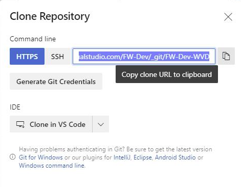

<span>Photo by <a href="https://unsplash.com/@simonmigaj?utm_source=unsplash&amp;utm_medium=referral&amp;utm_content=creditCopyText">Simon Migaj</a> on <a href="https://unsplash.com/s/photos/alone?utm_source=unsplash&amp;utm_medium=referral&amp;utm_content=creditCopyText">Unsplash</a></span>

I've been preparing some videos and learning materials for colleagues that work in Cloud but don't come from a Software Engineering background where disciplines such as version control and continuous integration are taken as granted.

## Preparing your machine

Install the most common extensions you might need. This is using [a tool called `scoop` which I've talked about before](\).

Open Powershell and run this:

```powershell

Set-ExecutionPolicy RemoteSigned -scope CurrentUser
Invoke-Expression (New-Object System.Net.WebClient).DownloadString('https://get.scoop.sh')
scoop bucket add extras
scoop install sudo aria2
scoop install git posh-git
scoop install vscode windows-terminal
```

### Install extensions for VSCode

These are the extensions you'll probably need, you can add any VSCode tends to prompt you for any others you may need when you work with a new file type that it recognises is associated with an one or more suggested extensions

```powershell
code --install-extension ms-azure-devops.azure-pipelines
code --install-extension ms-vscode.azure-account
code --install-extension ms-vscode.azurecli
code --install-extension ms-vscode.powershell
code --install-extension msazurermtools.azurerm-vscode-tools
```

## Git for Version Control

[Enable Long Paths in Windows](https://github.com/Azure/Enterprise-Scale/blob/main/docs/Deploy/getting-started.md#enabling-long-paths-on-windows)

Set some default configuration

```powershell
git config --global user.name 'Your Name'
git config --global user.email 'your.name@your.org'
```

???Info "What if I forget?"
    If you forget to set your email you get apretty helpful error message like this:

    ```
    Author identity unknown

    *** Please tell me who you are.

    Run

      git config --global user.email "you@example.com"
      git config --global user.name "Your Name"

    to set your account's default identity.
    Omit --global to set the identity only in this repository.

    fatal: unable to auto-detect email address
    ```
### Work on an existing Repository

Get the Git Clone URL from a repository you want to work on



Open VSCode

then in VS Code Ctrl-Shift-P and then type 'git clone'

!!!Info "Git Branches"
    You can read a brief guide on using Git branches in Azure DevOps to [create and delete a branch in your Git repo](https://docs.microsoft.com/en-us/azure/devops/repos/git/branches?view=azure-devops&tabs=command-line)

```powershell
git branch feature/TryingSomething
git checkout feature/TryingSomething
```

Change directory into the new directory that gets created after you have cloned the Repository

Give Git some configuration info about yourself for it to use when you puch your changes back to the central copy of the Repository (i.e. hosted in Azure DevOps or GitHub for example).

```powershell
git config user.name 'Your Name'
git config user.email 'your.name@your.org'
```

Once you have edited or added some files do this:

```powershell
git add .
git commit -m 'my commit message'
git push
```

you'll get an error if you followed the above:

```powershell
fatal: The current branch feature/TryingSomething has no upstream branch.
To push the current branch and set the remote as upstream, use

    git push --set-upstream origin feature/TryingSomething
```

Do what is says in the message!

```powershell
git push --set-upstream origin feature/TryingSomething
```

### Going even faster!

```powershell
scoop install git-town
git town hack feature/TrySomethingElse
```

Do some work...

```powershell
git commit -m 'Your commit message'
git town sync
```

Open up your Repository in Azure DevOps or GitHub and create a pull request. If all goes well your Pull Request will get approved and merged and you no longer need your local branch for this feature (the remote branch will have been deleted and it can be pretty fiddly with just Git commands to clean up your working directory)

```powershell
git town
```

## Pipelines for Build and Deployment