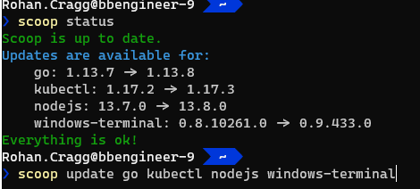
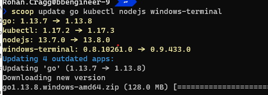

This page describes how I'm `current`-ly using Scoop (and other Package Managers) to configure my system

## *The Daddy...* **Scoop**!

Get [scoop.sh](https://scoop.sh/) and check out the [wiki](https://github.com/lukesampson/scoop/wiki) for latest info - or see below for the `TL;DR`

> Scoop focuses on open-source, command-line developer tools" but then those are the kinds of tools I'm using more and more...
...You're familiar with UNIX tools, and you wish there were more of them on Windows

*from: <https://github.com/lukesampson/scoop/wiki/Chocolatey-Comparison>*

### Install `scoop` and base set of tools
```powershell
Invoke-Expression (New-Object System.Net.WebClient).DownloadString('https://get.scoop.sh')
scoop install sudo
sudo scoop install 7zip git --global
scoop install curl grep sed less touch nano
scoop install coreutils
```

[coreutils](https://github.com/ScoopInstaller/Main/blob/master/bucket/coreutils.json) is a multi-tool package - *"a collection of GNU utilities such as bash, make, gawk and grep based on [MSYS](http://www.mingw.org/wiki/msys)"*

!!! Tip
    you can use the Unix tool `ls` after installing `coreutils` but you first need to remove the `PowerShell` alias already in place\
    *i.e. add this to your Powershell `$profile`:*

```powershell
Remove-Alias -Name ls
Remove-Alias -Name cat
Remove-Alias -Name mv
Remove-Alias -Name ps
Remove-Alias -Name pwd
Remove-Alias -Name rm
```

### Buckets
Then, I add additional [*Buckets*](https://github.com/lukesampson/scoop/wiki/Buckets). Buckets are collections of apps which are additional / optional to the [*main*](https://github.com/ScoopInstaller/Main/blob/master/bucket) bucket

```powershell
scoop bucket add extras
scoop bucket add versions
scoop bucket add Sysinternals
```

Then yet more handy tools I use (*some are from the **extras** bucket*):
```powershell
scoop install pwsh go docker kubectl helm make
scoop install azure-cli azure-ps storageexplorer dotnet-sdk pulumi
scoop install nodejs yarn openssl
scoop install azure-functions-core-tools
scoop install vcredist2019 linqpad notepadplusplus windows-terminal postman
scoop install paint.net krita brackets
```

!!! info
    Other useful (possibly useful?) buckets that I've not yet had a use for:

    - [nonportable](https://github.com/TheRandomLabs/scoop-nonportable/tree/master/bucket) - non-portable Applications that need to retain state between versions
    - full list of [known buckets](https://github.com/lukesampson/scoop#known-application-buckets)

### Paths
Referencing the path to an application installed by Scoop
```
%UserProfile%/scoop/apps
```
!!! note
    Those installed with the `--global` (and with the `sudo` command) will reside in the path

    `%ProgramData%/scoop/apps`

For each version of an application the files will be in a directory with the version number, but Scoop creates a *Shim* for the current version in the path `%UserProfile%\scoop\apps\{AppName}\current`.

For example: the path to *Python* (`python.exe`) will be either:
```
%UserProfile%\scoop\apps\python\3.8.1\python.exe
```
or:
```
%UserProfile%\scoop\apps\python\current\python.exe
```

For system tools you'll probably want to use the `current` shim to avoid those tools breaking between updates.

### Specifying Application Versions

The `versions` bucket contains a way to obtain versions other than the latest version of an application. This is used in combination with `scoop reset` command to switch between versions of an app. Scoop creates a shim for each version and `scoop reset` switches the `current` shim between those versions.

For example: [Switching-Ruby-And-Python-Versions](https://github.com/lukesampson/scoop/wiki/Switching-Ruby-And-Python-Versions)

### Updating Applications

`scoop status` is used to display any available updates:



...and then `scoop update` is used to update one or more applications (in a single command if you like!).



### Other miscellany

I had a problem installing [Brackets](https://brackets.io) and it was resolved by installing [LessMSI](http://lessmsi.activescott.com/) - but at the moment I'm not sure why...

!!!info What is LessMSI?
    A tool to view and extract the contents of a Windows Installer (.msi) file.

```powershell
scoop install lessmsi
scoop config MSIEXTRACT_USE_LESSMSI $true
```

## Common Pre-Requisites
The following is a set of common pre-requisites for installing tools and utilities (e.g. the `pip` package manager for python tools):

### `Python` and `PIP`
```powershell
scoop install python miniconda3
scoop install curl
curl https://bootstrap.pypa.io/get-pip.py -o get-pip.py
python get-pip.py
# pip and other tools be later upgraded by re-running the above or running:
python -m pip install -U pip
# when running behind a corporate propxy, the following command should still work:
sudo pip install --upgrade --trusted-host pypi.org --trusted-host files.pythonhosted.org pip setuptools wheel
```

## System Fonts
Here's another place where Scoop comes to the rescue to avoid clunky download and installs for system fonts!

!!!info
    note how `sudo` is being used to install the font as a global / system font - this obvisouly pops up a UAC prompt as it requires elevated provilege to install a system font...

```powershell
scoop bucket add nerd-fonts
sudo scoop install Delugia-Nerd-Font-Complete
```

## Productivity Tools

### MkDocs
> [MkDocs](https://www.mkdocs.org/) "Project documentation with Markdown"

I use this for writing **this site!**:
```powershell
pip install mkdocs
python .\scoop\apps\python\current\Tools\scripts\win_add2path.py
```

#### Install the Custom Theme
Using [Material theme](https://squidfunk.github.io/mkdocs-material/) and dependencies for [CodeHilite](https://squidfunk.github.io/mkdocs-material/extensions/codehilite/)
```powershell
pip install mkdocs-material
pip install pygments # for source code syntax highlighting
```

### PowerSession

This a version of [asciinema](https://asciinema.org/) for recording and re-playing PowerShell terminal sessions. Once recorded you upload the recording and share it with the world!

??? "What is `asciinema` and how do I get it?!"
    If you've never used asciinema before and you want to share a demo of something at a terminal then you'll love this tool. 

    - Simply go to <https://asciinema.org/>
    - click on **Log in / Sign up**
    - Enter an email address
    - Click on the link in the confirmation email
    - Choose a username
    - Stay logged into that browser on that machine and you can then `PowerSession auth` to create a link between the terminal and your asciinema account

    Apparently tt's based on Windows Pseudo Console (ConPTY).

``` powershell
# Installation
scoop install PowerSession

# Usage: Log in on the machine where you want to make a recording
Powersession auth
# ... copy the URL you're given and paste it into your browser as instructed

# Record a Terminal session (it will open a new session for you)
PowerSession rec a.txt

# Play back the recording to check that it's OK to upload
PowerSession play a.txt

# If it's ok then
PowerSession upload a.txt
```

An example of an uploaded recording looks like this!

<script id="asciicast-302157" src="https://asciinema.org/a/302157.js" async></script>
