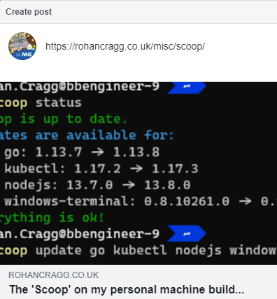
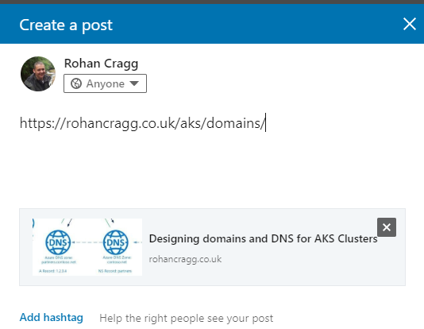
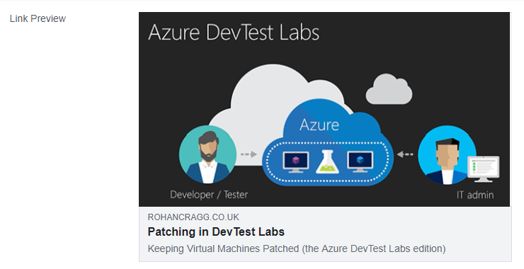

In order to have my posts look as nice as possible when they are shared on Social Media sites such as LinkedIn and Facebook I needed to work out how to control whether an featured image is shown and what text will be displayed by default.

## Social Media Link Sharing

To show the link sharing working in a couple of Social Media platforms here's how I wanted it to look in Facebook:



And here it is in LinkedIn:



When you enter a URL the platform picks a layout but it selects the title, a description, and an image by trying to parse information from the HTML page content. Facebook and others will primarily look for this information in Open Graph `<meta>` tags. Without these tags, the Facebook crawler will do its best to identify content some other way, but for me this was not working very well until I worked out how to add these tags to each content page, and how to have this content be relevant to each page.

???question "What is a META tag?"
    W3Schools describes a [META tag](https://www.w3schools.com/tags/tag_meta.asp) as follows:

    > Metadata is data (information) about data.
    
    > The <meta> tag provides metadata about the HTML document. Metadata will not be displayed on the page, but will be machine parsable.

    > Meta elements are typically used to specify page description, keywords, author of the document, last modified, and other metadata.

    > The metadata can be used by browsers (how to display content or reload page), search engines (keywords), or other web services.

I found [this page](https://developers.facebook.com/docs/sharing/webmasters) on the [Facebook for developers](https://developers.facebook.com/) site about how to use [Open Graph](https://ogp.me/) META tags

???about "The Open Graph protocol"
    The [Open Graph protocol](https://ogp.me/) enables any web page to become a rich object in a social graph. The Open Graph protocol was originally created at Facebook and is inspired by [Dublin Core](http://en.wikipedia.org/wiki/Dublin_Core), [link-rel canonical](http://googlewebmastercentral.blogspot.com/2009/02/specify-your-canonical.html), [Microformats](http://microformats.org/), and [RDFa](http://en.wikipedia.org/wiki/RDFa)

Because `<meta>` tags always go inside the `<head>` element of an `<html>` page I needed to work out how to manipulate the content of the `<head>` in each of the pages on this site.

## Customising generated HTML with MkDocs

My site is generated by [MkDocs](https://www.mkdocs.org/). MkDocs is a *static site generator* which is a piece of software that I'm using to convert the MarkDown format use to write each of these pages into [HTML](https://www.w3schools.com/html/default.asp). It does this for me automatically so that I don't need to write the content in HTML myself - but what if I want to change some aspects of the HTML code?

Much of the control over how the Markdown format is converted into HTML using MkDocs is controlled by a Theme. In this section on [how to customise the theme](https://www.mkdocs.org/user-guide/styling-your-docs/#customizing-a-theme) you're using (I'm using the excellent [Material Theme](https://squidfunk.github.io/mkdocs-material/) by [`@squidfunk`](https://twitter.com/squidfunk)) I worked out that I needed to [override one of the template block](https://www.mkdocs.org/user-guide/styling-your-docs/#overriding-template-blocks). In my case, in order to add additional `<meta>` tags I needed to override the `extrahead` block.

``` jinja  hl_lines="3 6"




    <meta property="og:title" content="{{ page.meta.og_title }}" />
    ...
    <meta property="og:image" content="{{ page.meta.og_image }}" />
    ...


```

You can also see from the sample above that I'm referencing the `page.meta` object which is where I can get data specific to each page and use it to build the content of each meta tag. *You can see the full code for the template override file `main.html` [here](https://github.com/rohancragg/blog-notes/blob/master/theme/main.html).*

## Defining document meta-data

The way this works is to use the python-markdown [Meta-Data extension](https://python-markdown.github.io/extensions/meta_data/) which adds a syntax for defining meta-data about a Markdown document. The Material theme that I've used [makes use of this metadata](https://squidfunk.github.io/mkdocs-material/extensions/metadata/) but I've take this a couple of steps futher by adding a few more of my own custom key-value pairs (such as `og_title` and `og_image`). The metadata is then added to the top of each `.md` document. The metadata is defined at the beginning of a markdown document and is in YAML format:

```yaml  hl_lines="10"
---
title: Scoop & Co
description: Using Scoop (and other Package Managers) to configure my system
hero: The 'Scoop' on my personal machine build...
date: 2020-02-04
authors:
    - Rohan Cragg
og_title: The 'Scoop' on my personal machine build...
page_path: misc/
og_image: media/scoop-update.png
---
```
The path to the image is then used in my template override to build a `<meta>` tag that looks like this

```html
<meta property="og:image" content="http://rohancragg.co.uk/misc/media/scoop-update.png" />
```
## Testing it out!

To assist with testing the tags in your Markup, Facebook provide a [Sharing Debugger](https://developers.facebook.com/tools/debug/?q=https%3A%2F%2Frohancragg.co.uk%2Fmisc%2Fscoop%2F). Here you can see that it provides a preview of what link sharing will look like for any URL you provide it to test:


